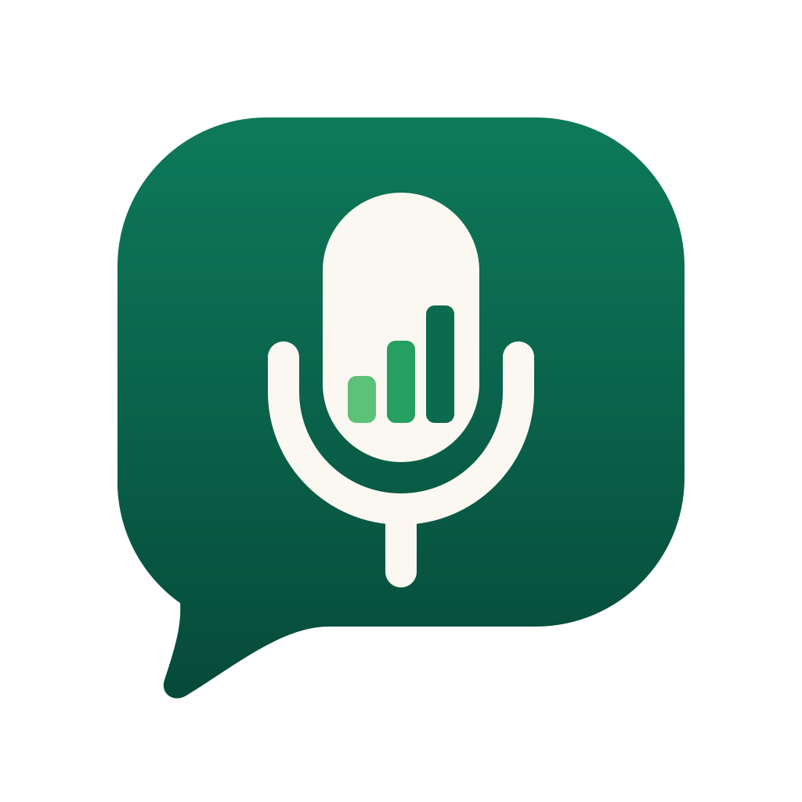

<div align="center">



# TradeVoice

**Records that speak your language.**

Voice-first bookkeeping for market traders. Say what you sold, in English, Yorùbá, Hausa or Igbo (Pidgin is understood too),
on WhatsApp or the web, and TradeVoice keeps the book.

</div>

## Why
A market trader sells on credit all day: *"Mama Tunde, take it, pay me Friday."* Those debts live in her head, a
notebook or a WhatsApp chat. She forgets who owes her, doesn't know her real profit, and when she asks a lender for a
loan, she has no records to show. Bookkeeping apps expect typing, forms and English. TradeVoice expects none of them.

## What it does
**Speak, snap or type.** *"I sell Mama Tunde two bags of rice for forty-five thousand. She go pay Friday."* TradeVoice
shows what it understood (customer, amount, item, quantity, credit or paid, due date), marks anything it isn't sure
of, and saves **only when the trader taps Save**. Corrections like *"no be 20k, na 2k"* fix the same record.

- **Replies in your language**, as text and as a voice note
- **Ask your book** anything: *"Who owes me the most?"*, *"Ṣé mo ní gbèsè lọ́wọ́ Alhaji?"*. Answers are calculated
  from the book, never guessed
- **Who owes you, who you owe**, due dates and late payers
- **Reminders with pay links**, drafted for you to send. TradeVoice never messages your customers on its own
- **Wholesale tools**: credit limits, customer statements, margin per item, cheapest supplier, usual orders
- **Notebook photos** turned into records you check before saving
- **Lender link**: share a read-only report of your trading history for 1, 7 or 30 days, and stop it any time
- **Private by default**: no sign-up (each phone gets its own book), hide amounts, PIN lock, CSV export, delete
  everything; voice notes and photos are deleted after reading; works offline and catches up later

## How it works
```
 Voice note / photo / text   (WhatsApp bot or web app)
        │
        ▼
 N-ATLaS ASR ── hears Nigerian English (and Pidgin), Yorùbá, Hausa, Igbo
        │
        ▼
 Qwen2.5 LLM on our NVIDIA Brev GPU (vLLM) ── words → transaction
 Qwen2.5-VL on the same GPU               ── notebook photo → lines
        │
        ▼
 Code guards ── the amount must have been said · corrections update the same record · unsure fields flagged
        │
        ▼
 Confirmation card ── trader taps Save / Change / Cancel
        │
        ▼
 The trader's own SQLite book ──► answers, reminders, insights, lender report (plain Python maths)
        │
        ▼
 Intron voices speak the reply our code wrote (text only if Intron is unavailable)
```
**Design rule: the AI reads and phrases; plain code does the maths.** Totals, balances and every answer about money
come from the book, so the AI can never invent a number. If the GPU or network is down, NVIDIA's cloud models answer,
and if everything fails, offline rules still record the entry.

## Quick start
Runs on a laptop with no GPU and no keys (offline rules; speech and photo reading need keys).
```bash
git clone https://github.com/Godzilla-lab/tradevoice.git && cd tradevoice
python -m venv .venv && source .venv/bin/activate
pip install -r requirements.txt
python src/web.py        # open http://localhost:8000, then Me → "Try with sample records"
```
To switch on speech, the AI models and the WhatsApp bot, copy `.env.example` to `.env` and add your own keys.
On an NVIDIA Brev GPU, `bash scripts/start_brev.sh` starts both models, the app and a public link.
`python scripts/check_models.py` and `python scripts/check_whatsapp.py` test each part and say what to fix.
Full setup and every setting: [`docs/TECHNICAL.md`](docs/TECHNICAL.md) · WhatsApp bot: [`docs/WHATSAPP.md`](docs/WHATSAPP.md)

## Tests
```bash
python eval/run_all.py                                              # 307 checks in 13 suites, no keys needed
python eval/run_eval.py --rules-only --cases eval/cases_hard.jsonl  # trap phrases in 5 languages
```
- **307 / 307** automated checks: the full demo flow, corrections, the WhatsApp bot, wholesale tools, lender and
  pay links, voice
- **464 / 464** test sentences in 5 languages (including 208 trap phrases) turned into the right record by the
  offline rules alone

The test sentences were written by our team, not yet by traders or native speakers of every language, so treat
these as a floor for the rules, not a measure of real-world accuracy. More in [`docs/TESTING.md`](docs/TESTING.md)
and [`docs/RESULTS.md`](docs/RESULTS.md).

## Project layout
```
tradevoice/
├── src/            the Python app (run: python src/web.py)
│   ├── web.py          web server + API; serves web/ and the WhatsApp webhook
│   ├── whatsapp.py     WhatsApp bot (Meta Cloud API): voice notes, photos, Yes/No buttons, voice replies
│   ├── converse.py     one conversation over one book: record, confirm, correct, ask, remind
│   ├── extract.py      words → transaction (LLM first, rules as fallback and amount check); llm.py
│   ├── asr.py, tts.py  hearing (N-ATLaS) and speaking (Intron)
│   ├── vision.py, photo.py              notebook photo → lines to check and save
│   ├── ledger.py, insights.py, assistant.py   the book, the maths, exact answers to questions
│   ├── extras.py       lender link, pay links (Paystack), reminders, receipts, PIN, CSV
│   ├── accounts.py     one private book per phone
│   ├── ui_text.py, tax.py   every screen word in 4 languages (N-ATLaS's: English, Yorùbá, Hausa, Igbo); sourced tax information
│   └── app.py, asr_server/  old Gradio screens (/admin) and an optional speech server
├── web/            the front end: HTML, CSS, JavaScript, service worker, icons
├── eval/           tests (python eval/run_all.py) and 464 test sentences
├── scripts/        start_brev.sh, check_models.py, check_whatsapp.py
├── docs/           technical notes, research, test results, screenshots; hackathon/ has the pitch and submission
└── requirements*.txt, .env.example, vercel.json
```

## Status and limits
TradeVoice is a working prototype, not a finished product.
- The Yorùbá, Hausa and Igbo wording and voices still need review by native speakers.
- It hasn't been tested with traders in a real market yet; heavy market noise lowers speech accuracy.
- Pay links need a Paystack account; the record score is not validated against real loan outcomes.
- Sample data (`src/seed_demo.py`) is synthetic and uses made-up names.


## License
MIT
